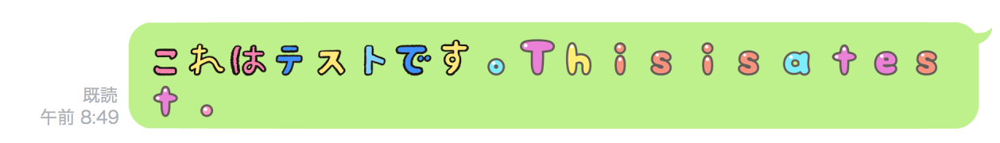

LineEmoji
====

## Overview
Convert text to LineEmoji


Fake notification

## Requirements
- python3
- requests
- Yahoo デベロッパーネットワーク appid

## Usage
```python
from LineEmoji.Emoji import Emoji
emoji = Emoji('your Yahoo app id')
text = emoji.convert(string="これはテストです。This is a test.", fake_notification="これは通知には表示されるが実際のメッセージは変化しない。")
print(text)
```
## Install
``` 
git clone https://github.com/k0tayan/LineEmoji.git
```
## Licence

[MIT](https://github.com/k0tayan/LineEmoji/blob/master/LICENSE)

## Author

[k0tayan](https://twitter.com/kotayan_0415)
